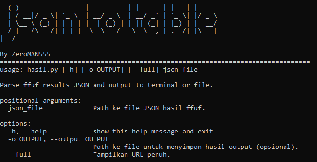

# json-to-table
convert the ffuf json results into a table



**json-to-table** adalah alat yang digunakan untuk mengubah hasil dari **ffuf** (Fuzz Faster U Fool) dalam format JSON menjadi tabel yang mudah dibaca. Alat ini memungkinkan pengguna untuk melihat hasil pencarian dengan cepat dan efisien, serta menampilkan detail lengkap dari setiap URL berdasarkan permintaan.

## Kegunaan

- Mengubah hasil pemindaian ffuf dalam format JSON menjadi tabel.
- Menyediakan opsi untuk menampilkan URL penuh dengan status dan informasi terkait lainnya.
- Menyediakan warna untuk status HTTP yang berbeda, memudahkan identifikasi status respon.

## Install ffuf (jika belum)
[Disini](https://github.com/ffuf/ffuf).

## Instalasi Tools

Sebelum menggunakan alat ini, pastikan Anda telah menginstal Python 3 dan pip di sistem Anda. Untuk menginstal dependensi yang diperlukan, jalankan perintah berikut:

```bash
git clone https://github.com/ZeroMAN555/json-to-table.git
cd json-to-table
pip install -r requirements.txt
```
## Penggunaan 

```bash
python3 hasil.py <path_ke_file_json> -o <path_ke_file_output (opsional)> [--full (opsional)]
```

